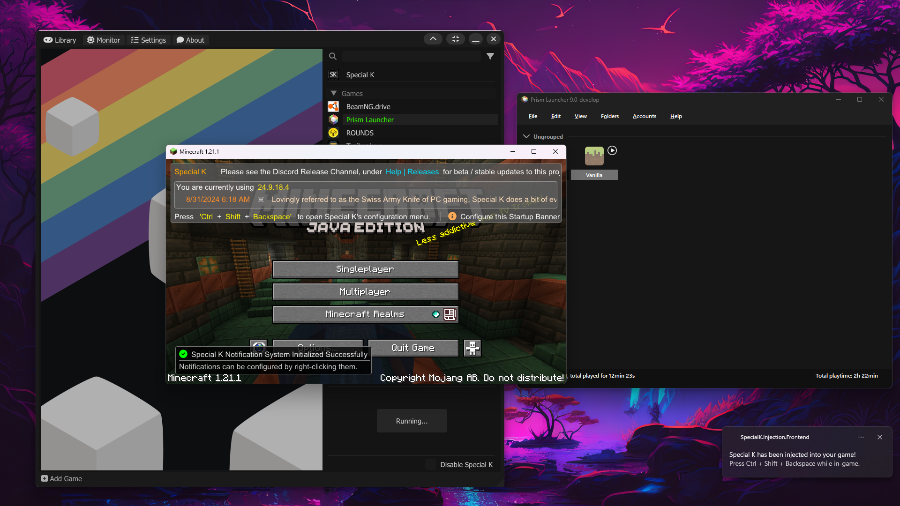
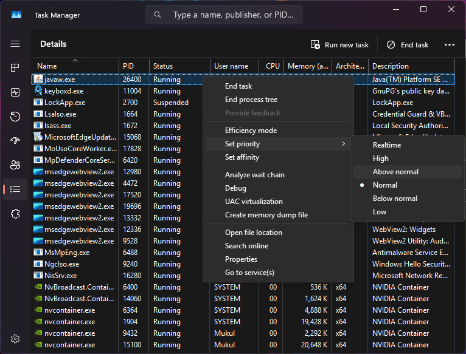

<div align="center">
  <a href="https://github.com/kyechan99/capsule-render">
    
  </a>
</div>

<br>

欢迎!这是一份 Minecraft Java 版优化指南（中文版）。

> [!NOTE]
> 1. 虽然这些调整能明显减少一些服务器和客户端卡顿,但最多只能带来适度的TPS提升和微小的FPS提升,同时可能会略微增加内存和CPU使用率。
>
> 2. 虽然这些参数很容易复制粘贴就忘,但它们并不能替代使用像Spark这样的模组来清理导致卡顿的东西。

<br>

# 性能优化模组
你可能会想"这很奇怪,为什么这里会出现性能优化模组?",但性能优化模组能带来比任何Java参数都更大的性能提升。如果你想追求纯粹的性能,不要只使用Optifine。有更好的性能优化模组,比如[Sodium](https://modrinth.com/mod/sodium)。Sodium原生支持Fabric(不像Optifine),其0.6 beta版本也支持NeoForge。

如果你想要纯粹的性能优化,可以看看[Simply Optimized](https://modrinth.com/modpack/sop)和[Adrenaline](https://modrinth.com/modpack/adrenaline)这两个整合包作为例子。

另一方面,如果你想要一个最新的Optifine替代品,[Fabulously Optimized](https://modrinth.com/modpack/fabulously-optimized)和[Additive](https://modrinth.com/modpack/additive)都能很好地模仿Optifine的功能,同时提供更好的性能和可定制性。

<br/>

# 选择Java发行版
来自Azul、Microsoft、Adoptium、亚马逊等的Java运行时基本上是相同的,因为它们都基于OpenJDK。一些值得注意的例外是:

1. **GraalVM** - 具有更激进的Java编译器。

2. **Clear Linux OpenJDK** - 使用高度兼容的OpenJDK基础,但其构建过程和依赖项[针对新CPU进行了优化](https://www.phoronix.com/review/zen4-clear-linux/2)。

3. **Platform Prime** - 由于接入了llvm,速度***非常***快,但目前与大多数模组不兼容,而且仅支持Linux。

4. **Red Hat Java 8** - 拥有Shenandoah垃圾收集器(这是唯一一个带有该收集器的Java 8 JDK)。

5. **OpenJ9** - 以牺牲Minecraft性能为代价消耗更少的内存。它还使用了与其他Java构建完全不同的参数。

如果你不知道选择哪个,我推荐GraalVM或Adoptium。你可以从[这里](https://adoptium.net/temurin/releases)下载Adoptium,从[这里](https://www.graalvm.org/downloads)下载GraalVM。

<br>

# 选择正确的Java版本
虽然任何Java发行版都可以正常工作,但你应该为你的游戏版本选择正确的Java版本。你可以使用[Minecraft Wiki](https://minecraft.wiki)查看正确的版本。只需在开头搜索"Java Edition"加上你的游戏版本,然后查看"最低Java版本"。

例如:


<br>

# 内存分配
最小和最大内存参数（`-xms` 和 `-xmx`）应设置为相同的值，如[此处](https://dzone.com/articles/benefits-of-setting-initial-and-maximum-memory-siz)所述。内存大小可以用兆字节或千兆字节设置，因此 `-Xms4096M` 和 `-Xmx8G` 均有效。

<details>
  <summary>在低内存系统中Minecraft会几乎占用全部RAM</summary>

将最小内存设置为低于最大内存以尽可能节省内存。同时尝试移除以下参数并改用服务器垃圾回收参数：
- `-XX:NmethodSweepActivity=1`
- `-XX:ReservedCodeCacheSize=400M`
- `-XX:NonNMethodCodeHeapSize=12M`
- `-XX:ProfiledCodeHeapSize=194M`
- `-XX:NonProfiledCodeHeapSize=194M`
  
</details>

> [!NOTE]
> 1. 分配过多内存可能破坏垃圾回收机制或直接拖慢游戏，即使你有充足内存。分配过少同样会导致性能下降或崩溃。运行Minecraft时密切观察任务管理器（或系统监视器），仅分配必要内存（通常不超过8G）。使用 `/sparkc gcmonitor` 可检测内存分配是否过高（暂停时间过长）或过低（频繁GC并出现低内存警告）。
> 
> 2. 若使用Prism Launcher或ATLauncher等第三方启动器，请勿直接使用内存参数，而应通过启动器的专用内存设置界面配置。

<br>

# 基础Java参数
<details>
  <summary>OpenJDK</summary>

### OpenJDK 8-（不推荐）

```
-XX:+UnlockExperimentalVMOptions -XX:+UnlockDiagnosticVMOptions -XX:+AlwaysActAsServerClassMachine -XX:+ParallelRefProcEnabled -XX:+DisableExplicitGC -XX:+AlwaysPreTouch -XX:+PerfDisableSharedMem -XX:+AggressiveOpts -XX:+UseFastAccessorMethods -XX:MaxInlineLevel=15 -XX:MaxVectorSize=32 -XX:+UseCompressedOops -XX:ThreadPriorityPolicy=1 -XX:+UseDynamicNumberOfGCThreads -XX:NmethodSweepActivity=1 -XX:ReservedCodeCacheSize=350M -XX:-DontCompileHugeMethods -XX:MaxNodeLimit=240000 -XX:NodeLimitFudgeFactor=8000 -XX:+UseFPUForSpilling
```

### OpenJDK 11+

```
-XX:+UnlockExperimentalVMOptions -XX:+UnlockDiagnosticVMOptions -XX:+AlwaysActAsServerClassMachine -XX:+AlwaysPreTouch -XX:+DisableExplicitGC -XX:NmethodSweepActivity=1 -XX:ReservedCodeCacheSize=400M -XX:NonNMethodCodeHeapSize=12M -XX:ProfiledCodeHeapSize=194M -XX:NonProfiledCodeHeapSize=194M -XX:-DontCompileHugeMethods -XX:MaxNodeLimit=240000 -XX:NodeLimitFudgeFactor=8000 -XX:+UseVectorCmov -XX:+PerfDisableSharedMem -XX:+UseFastUnorderedTimeStamps
```

### 额外性能参数 (实验性)[^1]

```
-XX:+UseFastUnorderedTimeStamps -XX:+UseCriticalJavaThreadPriority -XX:+EagerJVMCI -XX:+UseStringDeduplication -XX:+UseAES -XX:+UseAESIntrinsics -XX:+UseFMA -XX:+UseLoopPredicate -XX:+RangeCheckElimination -XX:+OptimizeStringConcat -XX:+UseCompressedOops -XX:+UseThreadPriorities -XX:+OmitStackTraceInFastThrow -XX:+RewriteBytecodes -XX:+RewriteFrequentPairs -XX:+UseFPUForSpilling -XX:+UseNewLongLShift -XX:+UseVectorCmov -XX:+UseXMMForArrayCopy -XX:+UseXmmI2D -XX:+UseXmmI2F -XX:+UseXmmLoadAndClearUpper -XX:+UseXmmRegToRegMoveAll -XX:+EliminateLocks -XX:+DoEscapeAnalysis -XX:+AlignVector -XX:+OptimizeFill -XX:+EnableVectorSupport -XX:+UseCharacterCompareIntrinsics -XX:+UseCopySignIntrinsic -XX:+UseVectorStubs -XX:UseAVX=2 -XX:UseSSE=4 -XX:+UseFastJNIAccessors -XX:+UseInlineCaches -XX:+SegmentedCodeCache -XX:ThreadPriorityPolicy=1
```

</details>

<details>
  <summary>GraalVM</summary>

### GraalVM 11-（不推荐）

```
-XX:+UnlockExperimentalVMOptions -XX:+UnlockDiagnosticVMOptions -XX:+AlwaysActAsServerClassMachine -XX:+ParallelRefProcEnabled -XX:+DisableExplicitGC -XX:+AlwaysPreTouch -XX:+AggressiveOpts -XX:+UseFastAccessorMethods -XX:+UseDynamicNumberOfGCThreads -XX:NmethodSweepActivity=1 -XX:ReservedCodeCacheSize=350M -XX:-DontCompileHugeMethods -XX:MaxNodeLimit=240000 -XX:NodeLimitFudgeFactor=8000 -XX:+UseFPUForSpilling -XX:+EnableJVMCI -XX:+UseJVMCICompiler -XX:+EagerJVMCI -Dgraal.TuneInlinerExploration=1 -Dgraal.CompilerConfiguration=enterprise -Dgraal.UsePriorityInlining=true -Dgraal.Vectorization=true -Dgraal.OptDuplication=true -Dgraal.DetectInvertedLoopsAsCounted=true -Dgraal.LoopInversion=true -Dgraal.VectorizeHashes=true -Dgraal.EnterprisePartialUnroll=true -Dgraal.VectorizeSIMD=true -Dgraal.StripMineNonCountedLoops=true -Dgraal.SpeculativeGuardMovement=true -Dgraal.InfeasiblePathCorrelation=true
```

若使用着色器，请将 `-Dgraal.VectorizeSIMD` 设为 `false`，因此版本存在兼容问题。该旧版本还会导致1.16.5 Astral Sorcery的星座渲染异常（可能与着色器Bug相关）。详见：https://github.com/HellFirePvP/AstralSorcery/issues/1963

### GraalVM 17+

```
-XX:+UnlockExperimentalVMOptions -XX:+UnlockDiagnosticVMOptions -XX:+AlwaysActAsServerClassMachine -XX:+AlwaysPreTouch -XX:+DisableExplicitGC -XX:NmethodSweepActivity=1 -XX:ReservedCodeCacheSize=400M -XX:NonNMethodCodeHeapSize=12M -XX:ProfiledCodeHeapSize=194M -XX:NonProfiledCodeHeapSize=194M -XX:-DontCompileHugeMethods -XX:+PerfDisableSharedMem -XX:+UseFastUnorderedTimeStamps -XX:+EagerJVMCI
```

### 额外性能参数 (实验性)[^1]

```
-XX:+UseFastUnorderedTimeStamps -XX:+UseCriticalJavaThreadPriority -XX:+UseStringDeduplication -XX:+UseAES -XX:+UseAESIntrinsics -XX:+UseFMA -XX:+UseLoopPredicate -XX:+RangeCheckElimination -XX:+OptimizeStringConcat -XX:+UseCompressedOops -XX:+UseThreadPriorities -XX:+OmitStackTraceInFastThrow -XX:+RewriteBytecodes -XX:+RewriteFrequentPairs -XX:+UseFPUForSpilling -XX:+UseNewLongLShift -XX:+UseVectorCmov -XX:+UseXMMForArrayCopy -XX:+UseXmmI2D -XX:+UseXmmI2F -XX:+UseXmmLoadAndClearUpper -XX:+UseXmmRegToRegMoveAll -XX:+EliminateLocks -XX:+DoEscapeAnalysis -XX:+AlignVector -XX:+OptimizeFill -XX:+EnableVectorSupport -XX:+UseCharacterCompareIntrinsics -XX:+UseCopySignIntrinsic -XX:+UseVectorStubs -XX:UseAVX=2 -XX:UseSSE=4 -XX:+UseFastJNIAccessors -XX:+UseInlineCaches -XX:+SegmentedCodeCache -XX:ThreadPriorityPolicy=1
```

### 额外 GraalVM 参数 (实验性)[^1]

```
-Dgraal.UsePriorityInlining=true -Dgraal.Vectorization=true -Dgraal.OptDuplication=true -Dgraal.DetectInvertedLoopsAsCounted=true  -Dgraal.LoopInversion=true -Dgraal.VectorizeHashes=true -Dgraal.EnterprisePartialUnroll=true -Dgraal.VectorizeSIMD=true -Dgraal.StripMineNonCountedLoops=true  -Dgraal.SpeculativeGuardMovement=true -Dgraal.TuneInlinerExploration=1 -Dgraal.LoopRotation=true -Dgraal.OptWriteMotion=true -Dgraal.CompilerConfiguration=enterprise
```

> ![!NOTE]
> Not all flags may be recognized by the JVM. You can just remove the problematic flags.

</details>

<details>
  <summary>OpenJ9</summary>

### OpenJ9（不推荐）

```
-XX:+IdleTuningGcOnIdle -XX:+UseAggressiveHeapShrink -XX:-OmitStackTraceInFastThrow -XX:+UseFastAccessorMethods -XX:+OptimizeStringConcat -Xshareclasses:allowClasspaths -Xshareclasses:cacheDir=./cache -Xaot -XX:+UseCompressedOops -XX:ObjectAlignmentInBytes=256 -Xshareclasses -XX:SharedCacheHardLimit=800M -Xtune:virtualized -XX:+TieredCompilation -XX:InitialTenuringThreshold=5 -Dlog4j2.formatMsgNoLookups=true -XX:-DisableExplicitGC -XX:InitiatingHeapOccupancyPercent=35 -XX:+UnlockExperimentalVMOptions -XX:MaxGCPauseMillis=6 -Djava.net.preferIPv4Stack=true -XX:-ParallelRefProcEnabled-XX:+UseTLAB -XX:ReservedCodeCacheSize=70M -XX:G1NewSizePercent=20 -XX:G1ReservePercent=20
```

</details>

<details>
  <summary>Platform Prime</summary>

### Platform Prime

通常无需特殊参数调优，但仍建议启用大页支持。详见：https://github.com/brucethemoose/Minecraft-Performance-Flags-Benchmarks/issues/49#issuecomment-1716138313
  
</details>

> [!NOTE]
> 添加 `--add-modules=jdk.incubator.vector` 可为部分服务器核心（例如明确支持该功能的Pufferfish和Purpur）调优。

<br>

# 垃圾回收
**垃圾回收参数应同时应用于Minecraft服务器和客户端**，因为默认的"暂停回收"机制会在客户端表现为卡顿，在服务器表现为延迟。使用Spark的 `/sparkc gcmonitor` 命令在游戏中观察暂停情况。任何老年代暂停都是不良现象，而年轻代G1GC回收应不频繁且短暂到难以察觉。

<br>

### 非主动ZGC 
非主动ZGC适合高内存/多核服务器。经测试其对服务器吞吐量无负面影响，且完全消除卡顿。但相比其他回收器需要更多内存和核心。启用参数：
```
-XX:+UseZGC -XX:AllocatePrefetchStyle=1 -XX:-ZProactive
```

> [!NOTE]
> 1. 它会对客户端FPS产生显著影响。
>
> 2. 非主动ZGC在Java 8中不可用,在Java 11中的性能比Java 17+差得多。
>
> 3. 比正常情况下分配更多的RAM和更多的`ConcGCThreads`。
>
> 4. GraalVM目前在使用ZGC时禁用EnableJVMCI,因为它不支持。

<br/>

### 分代ZGC
分代ZGC非常适合高内存/高核心数的服务器,它的设计目的是与唯一的其他分代GC - G1GC竞争。使用以下参数启用它:
```
-XX:+UseZGC -XX:AllocatePrefetchStyle=1 -XX:+ZGenerational
```

> [!NOTE]
> 1. 分代ZGC仅在Java 21+中可用
>
> 2. 比正常情况下分配更多的RAM和更多的`ConcGCThreads`。
>
> 3. GraalVM目前在使用ZGC时禁用EnableJVMCI,因为它不支持。
>
> 4. Java 23+不再需要`-XX:+ZGenerational`参数。如果你愿意,可以移除它,因为它会被忽略,因为分代已成为新的默认设置。

<br/>

### Shenandoah
Shenandoah在客户端表现良好,但会降低服务器吞吐量。使用以下参数启用它:
```
-XX:+UseShenandoahGC -XX:ShenandoahGCMode=iu -XX:ShenandoahGuaranteedGCInterval=1000000 -XX:AllocatePrefetchStyle=1
```

更多调优选项请参见[这里](https://wiki.openjdk.org/display/shenandoah/Main)。"启发式"和"模式"选项不会有太大变化(除了"compact",你不应该使用)。

> [!NOTE]
> 1. Red Hat OpenJDK 8是唯一支持Shenandoah的Java 8 JDK。
>
> 2. GraalVM目前不支持Shenandoah。

<br/>

### 客户端G1GC
G1GC是所有JRE的默认垃圾收集器。Aikar的[著名Minecraft服务器G1GC参数](https://aikar.co/2018/07/02/tuning-the-jvm-g1gc-garbage-collector-flags-for-minecraft/)在客户端上运行良好,但有两个注意事项:它们通过设置很高的`G1NewSizePercent`有效地[限制](https://www.oracle.com/technical-resources/articles/java/g1gc.html)了`MaxGCPauseMillis`参数,在某些客户端上产生长时间的卡顿,并且它们过于积极地收集老年代垃圾(因为客户端产生的垃圾_远_少于一个人口众多的服务器)。

这些参数类似于Aikar参数,但具有更短、更频繁的暂停,更不积极的G1混合收集和更积极的后台收集:
```
-XX:+UseG1GC -XX:MaxGCPauseMillis=37 -XX:+PerfDisableSharedMem -XX:G1HeapRegionSize=16M -XX:G1NewSizePercent=23 -XX:G1ReservePercent=20 -XX:SurvivorRatio=32 -XX:G1MixedGCCountTarget=3 -XX:G1HeapWastePercent=20 -XX:InitiatingHeapOccupancyPercent=10 -XX:G1RSetUpdatingPauseTimePercent=0 -XX:MaxTenuringThreshold=1 -XX:G1SATBBufferEnqueueingThresholdPercent=30 -XX:G1ConcMarkStepDurationMillis=5.0 -XX:GCTimeRatio=99 -XX:G1ConcRefinementServiceIntervalMillis=150 -XX:G1ConcRSHotCardLimit=16 -XX:AllocatePrefetchStyle=3
```

> [!NOTE]
> 1. Java 21+不再支持`-XX:G1ConcRefinementServiceIntervalMillis=150`参数和`-XX:G1ConcRSHotCardLimit=16`参数。如果你愿意,可以移除它们,因为它们会被忽略。
>
> 2. `G1NewSizePercent`和`MaxGCPauseMillis`可用于调整年轻代收集的频率/持续时间。如果你的设置出现任何老年代暂停,应该移除`G1HeapWastePercent=18`。或者,你可以提高它并将`G1MixedGCCountTarget`设置为2或1,使混合垃圾收集更加懒惰(代价是更高的内存使用)。
>
> 3. 如果你使用的是基于Java 8的GraalVM EE,将`-XX:AllocatePrefetchStyle=3`改为`-XX:AllocatePrefetchStyle=1`

<br/>

### 服务器G1GC
服务器上可以接受更长的暂停。这些参数与aikar默认值非常接近:
```
-XX:+UseG1GC -XX:MaxGCPauseMillis=130 -XX:+DisableExplicitGC -XX:+AlwaysPreTouch -XX:G1NewSizePercent=28 -XX:G1HeapRegionSize=16M -XX:G1ReservePercent=20 -XX:G1MixedGCCountTarget=3 -XX:InitiatingHeapOccupancyPercent=10 -XX:G1MixedGCLiveThresholdPercent=90 -XX:G1RSetUpdatingPauseTimePercent=0 -XX:SurvivorRatio=32 -XX:MaxTenuringThreshold=1 -XX:G1SATBBufferEnqueueingThresholdPercent=30 -XX:G1ConcMarkStepDurationMillis=5.0 -XX:G1ConcRefinementServiceIntervalMillis=150 -XX:G1ConcRSHotCardLimit=16 -XX:AllocatePrefetchStyle=3
```

> [!NOTE]
> 1. Java 21+不再支持`-XX:G1ConcRefinementServiceIntervalMillis=150`参数和`-XX:G1ConcRSHotCardLimit=16`参数。如果你愿意,可以移除它们,因为它们会被忽略。
>
> 2. `G1NewSizePercent`和`MaxGCPauseMillis`可用于调整年轻代收集的频率/持续时间。如果你的设置出现任何老年代暂停,应该移除`G1HeapWastePercent=18`。或者,你可以提高它并将`G1MixedGCCountTarget`设置为2或1,使混合垃圾收集更加懒惰(代价是更高的内存使用)。
>
> 3. 如果你使用的是基于Java 8的GraalVM EE,将`-XX:AllocatePrefetchStyle=3`改为`-XX:AllocatePrefetchStyle=1`

<br/>

### 垃圾收集线程
`-XX:ConcGCThreads=[某个数字]`控制垃圾收集器允许使用的后台线程的[*最大*数量](https://github.com/openjdk/jdk/blob/dd34a4c28da73c798e021c7473ac57ead56c9903/src/hotspot/share/gc/z/zHeuristics.cpp#L96-L104),默认值为`[逻辑(超线程)核心数 / 4]`。最新版本的Java会[根据需要减少gc线程数](https://wiki.openjdk.org/display/zgc/Main#Main-SettingConcurrentGCThreads)。

在某些情况下(尤其是使用ZGC或Shenandoah时),你可能想要将这个线程上限提高到默认值以上。我建议在大多数CPU上使用`[实际(非超线程)核心数 - 2]`,但你可能需要调整这个参数。如果设置得太低,垃圾收集可能跟不上Minecraft的速度,游戏会出现卡顿和/或开始大量消耗RAM并崩溃。如果设置得太高,可能会减慢游戏速度,特别是如果你运行的是Java 8。可能最好保持在8以下(对于ZGC和Shenandoah,你可能可以使用10)。

不需要其他"线程"标志,如`ParallelGCThreads`或`JVMCIThreads`,因为它们在Java 8+中默认启用并具有良好的自动设置。

<br/>

# 大页面

> [!CAUTION]
> 一些指南说你必须在Windows上以管理员身份运行Java和启动器。这已被证明是错误的,而且是一个重大的安全风险。

> [!NOTE]
> 如果你为 Minecraft 分配超过 8 GB 内存，在 Windows 系统上 Java 可能会崩溃。更多细节请参阅此问题：https://github.com/adoptium/adoptium-support/issues/626  
> 你可以尝试在管理员终端中运行 `enable-mmagent -pagecombining` 命令来修复此问题。

启用大页面可以通过减少系统负载来提高Minecraft服务器和客户端的性能。[Here's a good guide](https://kstefanj.github.io/2021/05/19/large-pages-and-java.html)

添加:
```
-XX:+UseLargePages -XX:LargePageSizeInBytes=2m
```

检查并确认在 Java 17 中通过 `-Xlog:gc+init` 参数是否成功启用了大页（Large Pages）支持。

对于任何 Java 版本或平台，如果大页面功能未生效，日志中会出现类似如下的警告：

```
Java HotSpot(TM) 64-Bit Server VM warning: JVM cannot use large page memory because it does not have enough privilege to lock pages in memory.
```

> [!NOTE]
> 1. Windows家庭版没有`gpedit.msc`,因此无法按照上面的指南操作,请改用[这个指南](https://awesomeprojectsxyz.blogspot.com/2017/11/windows-10-home-how-to-enable-lock.html?m=1),另外由于微软已经下架了提到的工具,你必须从[这里](https://gist.github.com/eyecatchup/0107bab3d92473cb8a3d3547848fc442)下载。
>
> 2. 在Linux上,你通常应该使用`-XX:+UseTransparentHugePages`。

<br/>

# SpecialK
SpecialK是一个类似于[ReShade](https://reshade.me/)的"通用"Windows模组,具有两个主要的性能优势:

- 一个"智能"帧限制器,可以减少卡顿,消除画面撕裂,节省电力,并在需要时节省CPU TDP以提升性能。它甚至可以与VRR或Nvidia Reflex一起工作。

- 一个名为OpenGL-IK的OpenGL到DirectX11包装器,可以消除Minecraft窗口模式的开销,并启用其他功能(如自动HDR或可调整大小的无边框窗口)。

从[这里](https://www.special-k.info/)下载。

添加你的Minecraft启动器。然后导航到你的javaw.exe所在的java bin文件夹,创建一个名为`SpecialK.OpenGL32`的空文件。使用SpecialK启动器启动你的Minecraft启动器,然后启动器将"注入"SpecialK到Minecraft中。


你可以通过SpecialK UI为你的Minecraft启动器创建一个桌面快捷方式,以获得更多便利。

确保关闭VSync和游戏内的Minecraft帧限制器。

<br>

# 进程优先级
启动Minecraft后,在Windows的任务管理器详细信息标签中将Java设置为"实时"进程优先级:



Linux用户可以在启动命令的开头添加`sudo nice -n -10`。

> [!CAUTION]
> 在Linux上,低于0的nice级别(最大为-20)需要以`root`身份运行nice,这反过来会以`root`身份运行Minecraft。这是一个安全风险。以下是一些解决方法:
> 1. 启动游戏并以`root`身份运行`renice -10 -p $(PID)`,使用Minecraft实例的pid。这是安全的,因为Minecraft本身并不是以`root`身份运行。
>
> 2. 修改`/etc/security/limits.conf`以允许非root用户使用负值。然后只需使用正常的nice命令而不需要`sudo`。如果你不知道自己在做什么,就不要这样做。
>
> 3. "黑客"方式编写脚本:`sudo nice -n -10 su <username> -c`。这是最简单的方法,但前两种方法可能更好。

<br/>

# 其他性能提升技巧
- 在Linux上运行Minecraft!在几乎所有情况下,它都运行得非常好。对于服务器,Clear Linux和RHEL经过了很好的优化,对于客户端,CachyOS/Arch非常棒。

- 确保Minecraft客户端使用你的独立GPU!检查F3选项卡,并在"**Windows图形设置**"中强制Minecraft使用它,_不要_在AMD/Nvidia控制面板中设置(因为它们似乎不再起作用)。

- Linux Wayland用户应该研究如何在Wayland上原生运行Minecraft,而不是通过xwayland。

- 关闭后台的所有程序,包括Discord、游戏启动器和你的浏览器!Minecraft是资源密集型的,不喜欢其他应用程序产生CPU中断或消耗磁盘I/O、RAM等。

<br />

[^1]: https://github.com/MeowIce/meowice-flags
